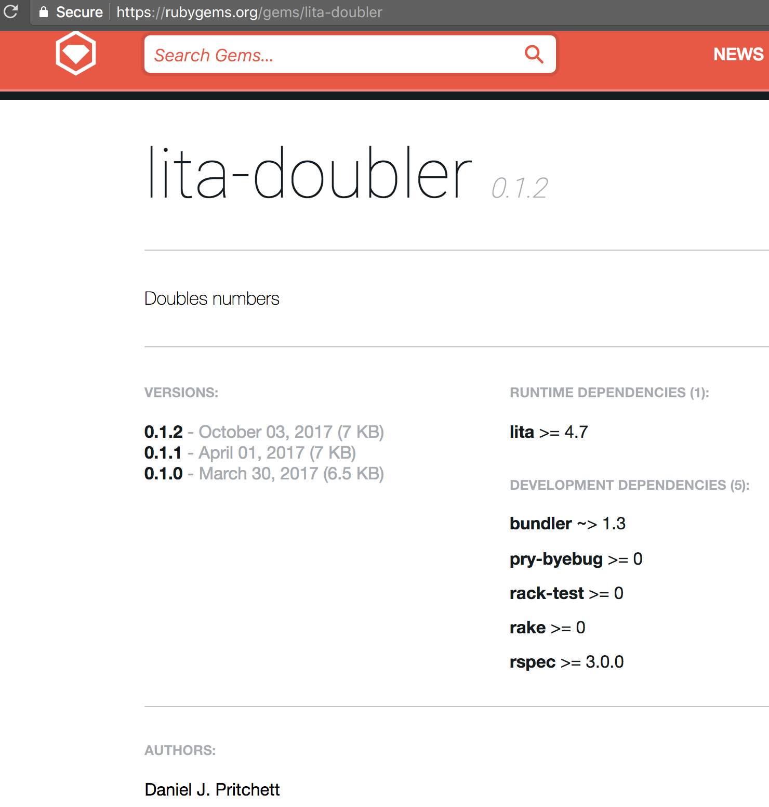

Daniel Pritchett // Memphis, TN

Southeast Ruby 2017

 <!-- .element: style="border: none; width: 300px; background-color: rgba(0,0,0,0); box-shadow: none; margin-left: 225px" -->

---

## Thanks Jason and team 💗 

---

# What's a chatbot though?

---

### General purpose
* Slackbot
* IRC bot
* Hubot & Lita

### Specialized
* Meeting schedulers
* Ticket buyers (like Kayak or Priceline)


## Who am I and why do I like chat so much?

----

A programmer

----

Hearing impaired


---

# What do chatbots look like?

---

# Meet Lita

----

# Pieces

- Core bot
- Skills / handlers
- Extensions

---

## Tools covered

* Hubot
* Lita
* `rake-release`
* Heroku
* Docker

---

## A first Lita skill

_"What time is it?"_<br/>
DateTime.now as a service! ✨

----

```
❯❯❯ pry
[1] pry(main)> require 'date'
true
[2] pry(main)> DateTime.now.rfc822
"Mon, 2 Oct 2017 20:04:26 -0500"
```

----

```
❯❯❯ lita handler what-time-is-it                                               
Do you want to test your plugin on Travis CI? ("yes" or "no", default is "no") no
Do you want to generate code coverage information with SimpleCov and Coveralls.io? ("yes" or "no", default is "no") no
      create  lita-what-time-is-it/lib/lita/handlers/what_time_is_it.rb
      create  lita-what-time-is-it/lib/lita-what-time-is-it.rb
      create  lita-what-time-is-it/spec/lita/handlers/what_time_is_it_spec.rb
      create  lita-what-time-is-it/spec/spec_helper.rb
      create  lita-what-time-is-it/locales/en.yml
      create  lita-what-time-is-it/templates/.gitkeep
      create  lita-what-time-is-it/Gemfile
      create  lita-what-time-is-it/lita-what-time-is-it.gemspec
      create  lita-what-time-is-it/.gitignore
      create  lita-what-time-is-it/Rakefile
      create  lita-what-time-is-it/README.md
If you plan to release this plugin as open source software, consider adding a LICENSE file to the root of the repository.
Common open source software licenses can be found at http://choosealicense.com/.
```

----

```
❯❯❯ cd lita-what-time-is-it/
❯❯❯ tree
.
├── Gemfile
├── README.md
├── Rakefile
├── lib
│   ├── lita
│   │   └── handlers
│   │       └── what_time_is_it.rb
│   └── lita-what-time-is-it.rb
├── lita-what-time-is-it.gemspec
├── locales
│   └── en.yml
├── spec
│   ├── lita
│   │   └── handlers
│   │       └── what_time_is_it_spec.rb
│   └── spec_helper.rb
└── templates

8 directories, 9 files
```

----

```rb
❯❯❯ cat lita-what-time-is-it.gemspec
Gem::Specification.new do |spec|
  spec.name          = "lita-what-time-is-it"
  spec.version       = "0.1.0"
  spec.authors       = ["Daniel J. Pritchett"]
  spec.email         = ["dpritchett@gmail.com"]
  spec.description   = "TODO: Add a description"
  spec.summary       = "TODO: Add a summary"
  spec.homepage      = "TODO: Add a homepage"
  spec.license       = "TODO: Add a license"
  spec.metadata      = { "lita_plugin_type" => "handler" }

  spec.files         = `git ls-files`.split($/)
  spec.executables   = spec.files.grep(%r{^bin/}) { |f| File.basename(f) }
  spec.test_files    = spec.files.grep(%r{^(test|spec|features)/})
  spec.require_paths = ["lib"]

  spec.add_runtime_dependency "lita", ">= 4.7"

  spec.add_development_dependency "bundler", "~> 1.3"
  spec.add_development_dependency "pry-byebug"
  spec.add_development_dependency "rake"
  spec.add_development_dependency "rack-test"
  spec.add_development_dependency "rspec", ">= 3.0.0"
end
```

----

## Built-in specs

---

## A tour of Lita skills

----

## DOUBLER
Basic skill, 2+2

----

## IMGFLIP MACRO MAKER
Jokes with friends

----

## WHAT'S BRAD EATING?
HTML scraping a photoblog

----

## ALEXA NEWSFEED
* Ephemeral storage
* IoT integration

----

## ALEXA RECORDER

* Multi-skill interaction

---

## Releasing the gem

### rake release

```
❯❯❯ rake -T | grep rel
rake release[remote]  # Create tag v1.1.1 and build and push lita-imgflip-memes-1.1.1.gem to Rubygems
```

----

```
❯❯❯ rake release                                                                                     ~/P/b/l/lita-doubler (master)
lita-doubler 0.1.2 built to pkg/lita-doubler-0.1.2.gem.
Tagged v0.1.2.
Pushed git commits and tags.
Pushed lita-doubler 0.1.2 to rubygems.org.
```

----

 <!-- .element: style="border: none; width: 600px; background-color: rgba(0,0,0,0); box-shadow: none; " -->

---


<div style="float: left; width: 40%">
  
  <h2>Want more?</h2>
</div>

<div style="float: right; width: 50%">
  <ul>
    <li>Find me at <a href="https://twitter.com/dpritchett">@dpritchett 🐦</a></li>
    <li>Listen in on the 🎙 <a href="http://podcast.clearfunction.com/96df4cd6">It Depends podcast - chatbots episode! 🎙</a></li>
    <li>Hire us at <a href="http://clearfunction.com">clearfunction.com</a></li>
  </ul>
</div>


 <!-- .element: style="border: none; width: 300px; background-color: rgba(0,0,0,0); box-shadow: none; margin-left: 225px" -->

