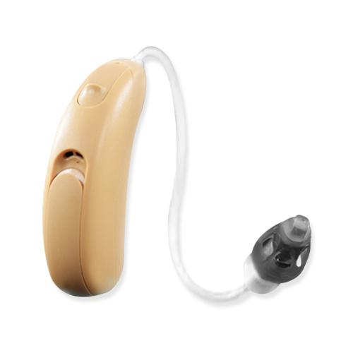
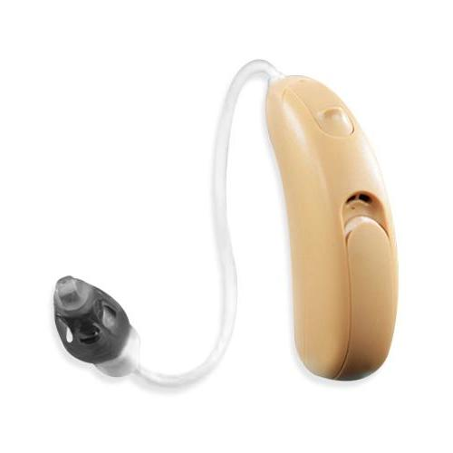
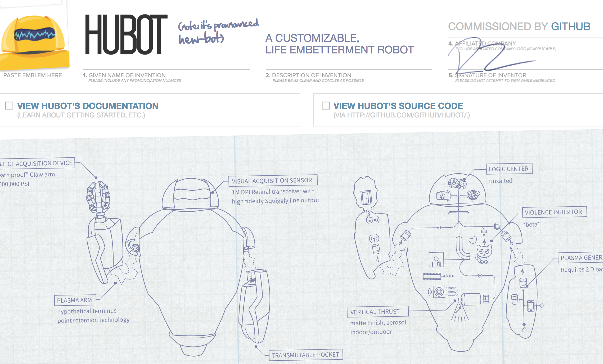
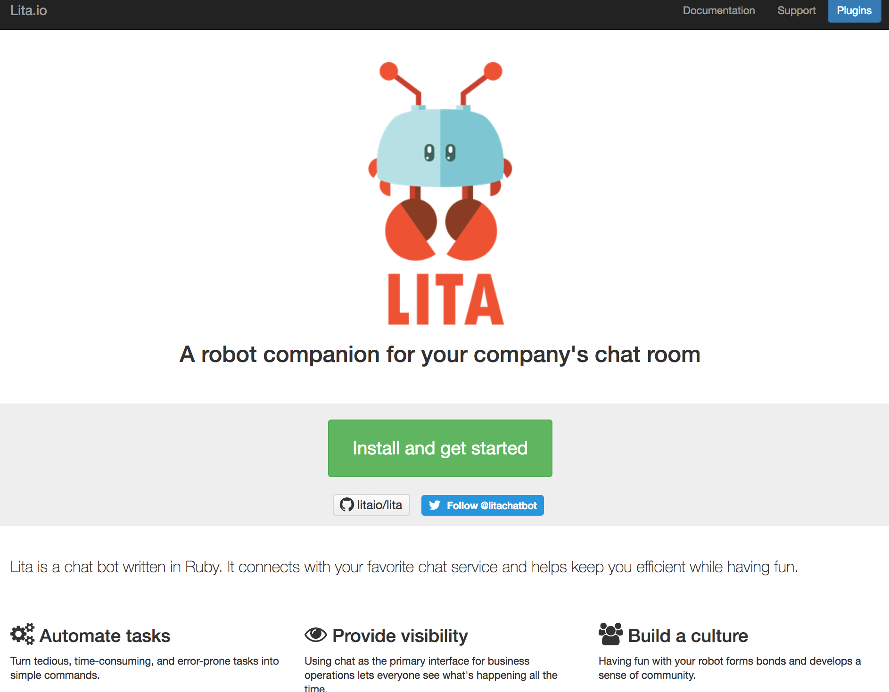
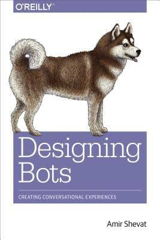
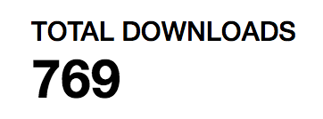

Daniel Pritchett // Memphis, TN

Southeast Ruby 2017

 <!-- .element: style="border: none; width: 300px; background-color: rgba(0,0,0,0); box-shadow: none;" -->

 <!-- .element: style="border: none; width: 300px; background-color: rgba(0,0,0,0); box-shadow: none; margin-left: 225px" -->

---

## Thanks team Charnes 💗 

 <!-- .element: style="border: none; width: 300px; background-color: rgba(0,0,0,0); box-shadow: none;" -->
👶

----

 <!-- .element: style="border: none; width: 300px; background-color: rgba(0,0,0,0); box-shadow: none;" -->

---

🤖
# > Why chatbots?
### What's a chatbot though?
### How do I start a bot?
### Publish a gem!

----

## Who am I and why do I like chat so much?

----

A programmer

----

Hearing impaired

 <!-- .element: style="border: none; width: 300px; background-color: rgba(0,0,0,0); box-shadow: none; " -->
 <!-- .element: style="border: none; width: 300px; background-color: rgba(0,0,0,0); box-shadow: none; " -->

----

 <!-- .element: style="border: none; background-color: rgba(0,0,0,0); box-shadow: none; " -->

----

 <!-- .element: style="width: 450px; border: none; background-color: rgba(0,0,0,0); box-shadow: none; " -->

---


🤖
### Why chatbots?
# > What's a chatbot though?
### How do I start a bot?
### Publish a gem!

----

### General purpose
* Slackbot
* IRC bot
* Hubot & Lita

 <!-- .element: style="border: none; width: 300px; background-color: rgba(0,0,0,0); box-shadow: none; " -->

----

 <!-- .element: style="border: none; width: 960px; background-color: rgba(0,0,0,0); box-shadow: none; " -->

----

 <!-- .element: style="border: none; width: 700px; background-color: rgba(0,0,0,0); box-shadow: none; " -->

----

### Specialized
* Meeting schedulers
* Ticket buyers (like Kayak or Priceline)
* Affirmations
* Style coach



---

🤖
###  Why chatbots?
### What's a chatbot though?
# > How do I start a bot?
### Publish a gem!

----

# Meet Lita

----

# Pieces

- Core bot
- Skills / handlers
- Extensions

----

## A first Lita skill

_"What time is it?"_<br/>
DateTime.now as a service! ✨

----

```
❯❯❯ pry
[1] pry(main)> require 'date'
true
[2] pry(main)> DateTime.now.rfc822
"Mon, 2 Oct 2017 20:04:26 -0500"
```

----

```
❯❯❯ lita handler what-time-is-it                                               
Do you want to test your plugin on Travis CI? ("yes" or "no", default is "no") no
Do you want to generate code coverage information with SimpleCov and Coveralls.io? ("yes" or "no", default is "no") no
      create  lita-what-time-is-it/lib/lita/handlers/what_time_is_it.rb
      create  lita-what-time-is-it/lib/lita-what-time-is-it.rb
      create  lita-what-time-is-it/spec/lita/handlers/what_time_is_it_spec.rb
      create  lita-what-time-is-it/spec/spec_helper.rb
      create  lita-what-time-is-it/locales/en.yml
      create  lita-what-time-is-it/templates/.gitkeep
      create  lita-what-time-is-it/Gemfile
      create  lita-what-time-is-it/lita-what-time-is-it.gemspec
      create  lita-what-time-is-it/.gitignore
      create  lita-what-time-is-it/Rakefile
      create  lita-what-time-is-it/README.md
If you plan to release this plugin as open source software, consider adding a LICENSE file to the root of the repository.
Common open source software licenses can be found at http://choosealicense.com/.
```

----

```
❯❯❯ cd lita-what-time-is-it/
❯❯❯ tree
.
├── Gemfile
├── README.md
├── Rakefile
├── lib
│   ├── lita
│   │   └── handlers
│   │       └── what_time_is_it.rb
│   └── lita-what-time-is-it.rb
├── lita-what-time-is-it.gemspec
├── locales
│   └── en.yml
├── spec
│   ├── lita
│   │   └── handlers
│   │       └── what_time_is_it_spec.rb
│   └── spec_helper.rb
└── templates

8 directories, 9 files
```

----

```rb
❯❯❯ cat lita-what-time-is-it.gemspec
Gem::Specification.new do |spec|
  spec.name          = "lita-what-time-is-it"
  spec.version       = "0.1.0"
  spec.authors       = ["Daniel J. Pritchett"]
  spec.email         = ["dpritchett@gmail.com"]
  spec.description   = "TODO: Add a description"
  spec.summary       = "TODO: Add a summary"
  spec.homepage      = "TODO: Add a homepage"
  spec.license       = "TODO: Add a license"
  spec.metadata      = { "lita_plugin_type" => "handler" }

  spec.files         = `git ls-files`.split($/)
  spec.executables   = spec.files.grep(%r{^bin/}) { |f| File.basename(f) }
  spec.test_files    = spec.files.grep(%r{^(test|spec|features)/})
  spec.require_paths = ["lib"]

  spec.add_runtime_dependency "lita", ">= 4.7"

  spec.add_development_dependency "bundler", "~> 1.3"
  spec.add_development_dependency "pry-byebug"
  spec.add_development_dependency "rake"
  spec.add_development_dependency "rack-test"
  spec.add_development_dependency "rspec", ">= 3.0.0"
end
```

----

## Built-in specs

----

Notes on deployment

----

## A tour of Lita skills

----

## DOUBLER
Basic skill, 2+2

----

## IMGFLIP MACRO MAKER
Jokes with friends

----

## WHAT'S BRAD EATING?
HTML scraping a photoblog

----

## ALEXA NEWSFEED
* Ephemeral storage
* IoT integration

----

## ALEXA RECORDER

* Multi-skill interaction

---

🤖
### Why chatbots?
### What's a chatbot though?
### How do I start a bot?
# > Publish a gem!
ok we already did that one 😅

----

### rake release 😮

```
❯❯❯ rake -D

rake build
    Build lita-alexa-news-recorder-0.1.8.gem into the pkg directory.

...

rake release[remote]
    Create tag v0.1.8 and build and push lita-alexa-news-recorder-0.1.8.gem to Rubygems
    To prevent publishing in Rubygems use `gem_push=no rake release`

rake spec
    Run RSpec code examples
```

----

```
❯❯❯ rake release                                                                                     ~/P/b/l/lita-doubler (master)
lita-doubler 0.1.2 built to pkg/lita-doubler-0.1.2.gem.
Tagged v0.1.2.
Pushed git commits and tags.
Pushed lita-doubler 0.1.2 to rubygems.org.
```

----

 <!-- .element: style="border: none; width: 600px; background-color: rgba(0,0,0,0); box-shadow: none; " -->

----

I need to address a rumor

----

Rubygems download stats are REAL\*
 <!-- .element: style="border: none; width: 600px; background-color: rgba(0,0,0,0); box-shadow: none; " -->
<p>
💯💯💯💯💯💯💯
</p>

---


<div style="float: left; width: 40%">
  
  <h2>Want more?</h2>
</div>

<div style="float: right; width: 50%">
  <ul>
    <li>Writing a chatbots book for PragProg!</li>
    <li>Find me at <a href="https://twitter.com/dpritchett">@dpritchett 🐦</a></li>
    <li>Listen in on the 🎙 <a href="http://podcast.clearfunction.com/96df4cd6">It Depends podcast - chatbots episode! 🎙</a></li>
    <li>Hire us at <a href="http://clearfunction.com">clearfunction.com</a></li>
  </ul>
</div>


 <!-- .element: style="border: none; width: 300px; background-color: rgba(0,0,0,0); box-shadow: none; margin-left: 225px" -->

