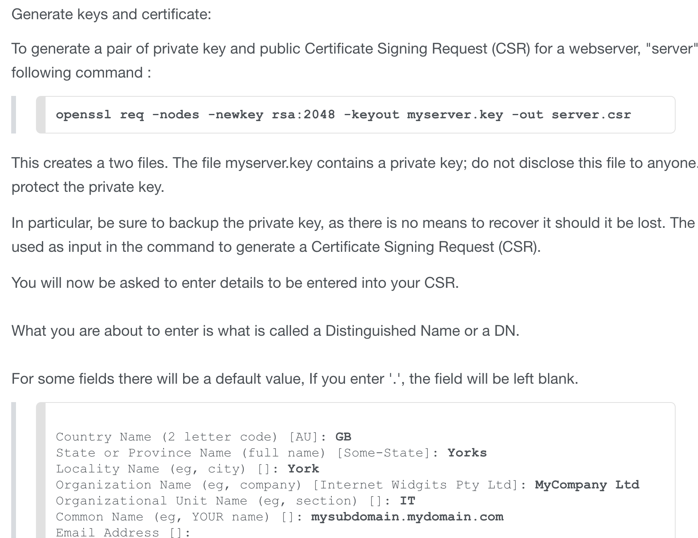

## Deploy an SSL-secured 🔐 Go microservice with a free certificate from Let's Encrypt

Daniel Pritchett // Clear Function // Memphis, TN

Devspace 2016

---

<!-- .slide: data-background="img/mr_fusion.gif" -->

## Buckle up

* This talk is probably better suited for intermediate level developers/admins and up
* Examples are Unix, but the tools and concepts are portable elsewhere
* I love questions! 💖💖💖

---

## What are we going to cover exactly?

* SSL

* Go

* Microservices

* Let's Encrypt

---

## SSL

> Transport Layer Security (TLS) and its predecessor, Secure Sockets Layer (SSL), both frequently referred to as "SSL", are cryptographic protocols that provide communications security over a computer network.
- [Wikipedia](https://en.wikipedia.org/wiki/Transport_Layer_Security)


----


## What's SSL doing for me?

* A padlock on your web page
* Raises user confidence in your security
* No unsightly _"This page may be hacking your Gibsons!"_ warnings

🍩💻


----


## I've never set up SSL before, is it easy?

Not exactly...



----

## What if I just want to play around with a sorta-secure site for free?

* Historically SSL certs started at $100 or so - not really hobbyist level stakes in the age of weekend github projects
* You can always generate a "snake oil" cert
* We'll save Let's Encrypt for the end

---

## Go


----

## Go

* A programming language
* Created at Google
* Open source

----

## Go

* Statically typed
* Statically _LINKED_ (single-binary deploys!)
* Small syntax
* Very fast compiles are a core value
* Nice built-in concurrency primitives 
* Cross compiles* between Windows, OSX, Linux, amd64, 386, ARM

----

## Behold: Go

```go
func diceHandler(w http.ResponseWriter, req *http.Request) {
  fmt.Fprintf(w, "You rolled a %d.", rollDice())
}

func rollDice() int {
  return rand.Intn(6) + 1
}
```

----

## Fast compiles, chunky files

```sh
daniel@Molly-Millions ~/c/d/diceRoller> time go build .
        1.19 real         1.19 user         0.20 sys
daniel@Molly-Millions ~/c/d/diceRoller> ll diceRoller
-rwxr-xr-x  1 daniel  staff   7.2M Oct 10 18:34 diceRoller
daniel@Molly-Millions ~/c/d/diceRoller>
```

---

## Microservice
Ok, maybe this is just one really tiny web app.

```sh
daniel@Molly-Millions ~/c/d/diceRoller> curl https://dice.dpritchett.net
You rolled a 6.
daniel@Molly-Millions ~/c/d/diceRoller> curl https://dice.dpritchett.net
You rolled a 3.
daniel@Molly-Millions ~/c/d/diceRoller> curl https://dice.dpritchett.net
You rolled a 1.
daniel@Molly-Millions ~/c/d/diceRoller> curl https://dice.dpritchett.net
You rolled a 2.
daniel@Molly-Millions ~/c/d/diceRoller> time curl https://dice.dpritchett.net
You rolled a 3.        0.40 real         0.02 user         0.00 sys
daniel@Molly-Millions ~/c/d/diceRoller>
```

----

## But!

* We can put a lot of really tiny webapps on a low-cost VPS💧💧💧
* We can give them all free SSL!🔒
* We could daemonize and log them all with standard Unix daemon management tooling
* We could distribute them as Docker containers!

----

## Containerized [microthingies](https://github.com/dpritchett/windtalker)
```Dockerfile
FROM ruby:2.1.4

MAINTAINER Daniel J. Pritchett <dpritchett@gmail.com>

RUN apt-get update -qq
RUN apt-get install espeak -qy

ADD Gemfile      /webapp/Gemfile
ADD Gemfile.lock /webapp/Gemfile.lock

WORKDIR          /webapp
RUN              bundle

ADD .            /webapp
```

----

## Now we can do text to speech in our IRC bots and other super important places

```rb
get '/say/:words' do
  content_type 'audio/wav'

  words   = params[:words].gsub(/[^\w]/, ' ')
  raw_wav = `echo #{words} | espeak -v whisper --stdout`

  headers['Content-Encoding'] = 'gzip'

  StringIO.new.tap do |io|
    gz = Zlib::GzipWriter.new(io)
    begin
      gz.write(raw_wav)
    ensure
      gz.close
    end
  end.string
end
```

----

## Free SSL... with Caddy and Let's Encrypt

* [Caddy](https://caddyserver.com/) is an HTTP/2 web server written in Go
* It uses its own `Caddyfile` config format
* It offers dead simple HTTPS via Let's Encrypt

----

## Caddyfile

```sh
root@bloggy:/etc/caddy cat Caddyfile
# dice demo
dice.dpritchett.net {
        proxy / localhost:8001
        log syslog
}
```

If you want more than one 'microservice' just run it on a different port and tell Caddy where to find it and which routes to serve it under.

----

## Upstart script

```config
root@bloggy:/etc/init# cat caddy.conf
description "Caddy HTTP/2 web server"

start on runlevel [2345]
stop on runlevel [016]

console log

setuid www-data
setgid www-data

respawn
respawn limit 10 5

reload signal SIGUSR1

# Let's Encrypt certificates will be written to this directory.
env HOME=/etc/caddy

limit nofile 1048576 1048576

script
        cd /etc/caddy
        rootdir="$(mktemp -d -t "caddy-run.XXXXXX")"
        exec /usr/local/bin/caddy -agree -conf=/etc/caddy/Caddyfile -root=$rootdir
end script
```

---

## Let's Encrypt

> [Let’s Encrypt](https://letsencrypt.org/) is a new Certificate Authority: It’s free, automated, and open. 


----

## Let's Encrypt

* Free!
* Finally developers can publish speculative and hobby apps with true HTTPS; no $100 buy-in 💸💸💸

----

## How does it work?

1. Domain Validation
2. Certificate Issuance and Revocation

🔑🔑🙏🙏🙏

https://letsencrypt.org/how-it-works/

----

## Domain Validation

> Let’s Encrypt identifies the server administrator by public key. The first time the agent software interacts with Let’s Encrypt, it generates a new key pair and proves to the Let’s Encrypt CA that the server controls one or more domains. This is similar to the traditional CA process of creating an account and adding domains to that account.

----

## Domain Validation


----

## Certificate Issuance

> Once the agent has an authorized key pair, requesting, renewing, and revoking certificates is simple—just send certificate management messages and sign them with the authorized key pair.


----

## Known incompatibilities

https://letsencrypt.org/docs/certificate-compatibility/
```
Known Incompatible
Blackberry OS v10, v7, & v6
Android < v2.3.6
Nintendo 3DS
Windows XP prior to SP3
cannot handle SHA-2 signed certificates
Java < JDK 8u101
```

---

## Wrap up

* We have a little microservice written in Go: [github.com/dpritchett/diceRoller](https://github.com/dpritchett/diceRoller)
* It's got simple, free HTTPS thanks to Let's Encrypt ([letsencrypt.org](https://letsencrypt.org)) and Caddy ([caddyserver.com](https://caddyserver.com))
* A padlock icon on a website doesn't guarantee trustworthy site admins
* Certs last 90 days
